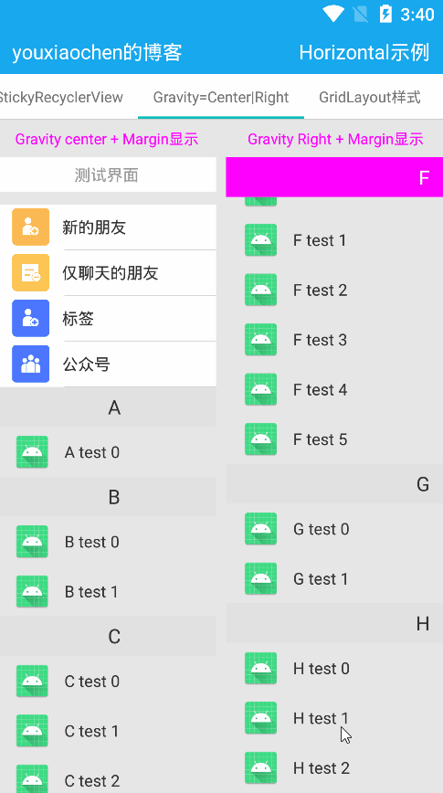

# StickyRecyclerView支持header, footer, 基于ExpandableRecyclerView
#### 用Drawing的方式的StickyRecyclerView, 核心类StickyManager, CharIndexView, CharIndexMediator
#### 适合布局任意布局方式的StickyLayoutView

#### gradle配置
```
allprojects {
    repositories {
    ...
    maven { url 'https://jitpack.io' }
    }  
}

dependencies {
    implementation 'com.github.youxiaochen:sticky-recyclerview:1.0.4'
}
```

#### [测试包下载](image-and-apk/sticky-recyclerview-demo.apk)

#### 使用, 最简单使用两行代码即可
```
private var stickyView: StickyRecyclerView
private var adapter: StickAdapter
private var indexView: CharIndexView

override fun onCreate(savedInstanceState: Bundle?) {
    super.onCreate(savedInstanceState)
    ......
    //首先设置适配器, 通过CharIndexMediator交给LifecycleOwner自动管理detach
    //也可单独使用CharIndexView设置适配器, 自己设置监听回调
    stickyView.setStickyAdapter(adapter)
    CharIndexMediator(stickyView, indexView).attach(this)
}

```

#### 亦可使用代码生成控件
```
//用于代码生成控件
public StickyRecyclerView(@NonNull Context context, @NonNull StickyParams params) {
    this(context, params, new DrawingStickyManager());
}

//用于代码生成控件
public StickyRecyclerView(@NonNull Context context, @NonNull StickyParams params, @NonNull StickyManager stickyManager) {
    super(context);
    initialize(params, stickyManager);
}
```

#### CharIndexView相关属性, 配合CharIndexMediator使用更方便
```
内部Adapter类
public static abstract class Adapter {
    ......
    
    //字符索引数量
    public abstract int getItemCount();

    //当前字符索引
    public abstract char getItemChar(int position);
}
```
| CharIndexView相关属性                     | 说明                                     |
|---------------------------------------|----------------------------------------|
| indexOrientation                      | 布局方向支持垂直vertical/水平方向horizontal        |
| indexItemSize                         | 画单个字符的item正方形矩阵大小                      |
| indexTextSize                         | 索引字符的大小                                |
| indexTextColor, selectIndexTextColor  | 索引字符颜色和滑动select时当前颜色                   |
| selectIndexBgDrawable                 | 索引字符select的背景drawable                  |
| indexDrawableStart                    | 类似TextView的水平时drawableLeft/垂直时drawableTop |
| indexDrawablePadding                  | 类似类似TextView的drawablePadding           |
| indicatorTextSize, indicatorTextColor | touch时的指示器文字大小                         |
| indicatorBgDrawable, indicatorPadding | 指示器背景(支持.9)及与索引字符的padding距离            |
| indicatorAutoCheck                    | 自动校正与Sticky的当前index一致                  |

#### 参考图


#### StickyRecyclerView相关属性 extends ExpandableRecyclerView
```
内部StickyAdapter类, 用法与ExpandableAdapter一致
public static abstract class StickyAdapter<GVH extends GroupViewHolder, CVH extends ChildViewHolder> extends ExpandableAdapter<GVH, CVH> {

    @Override
    public boolean groupCanClick() {
        return false;
    }

    @Override
    public void onGroupViewAttachedToWindow(@NonNull GVH holder) {
        ViewGroup.LayoutParams params = holder.itemView.getLayoutParams();
        if ((params instanceof StaggeredGridLayoutManager.LayoutParams)) {
            StaggeredGridLayoutManager.LayoutParams sParams = (StaggeredGridLayoutManager.LayoutParams) params;
            sParams.setFullSpan(true);
        }
    }

    //获取Sticky的item对象
    @NonNull
    public abstract String getStickerItem(int groupPos);
}
```
| StickyRecyclerView相关属性   | 说明                                                                    |
|--------------------------|-----------------------------------------------------------------------|
| stickySize               | Sticky的Header大小垂直时为高度, 水平时为宽度                                         |
| stickyTextSize           | Sticky画的Header字符大小                                                    |
| stickyTextColor          | 字符颜色,支持selctor,配置state_first=true时即为Stickied颜色见demo                   |
| stickyBackgroundColor    | Sticky背景颜色支持selector 配置state_first=true时即为Stickied颜色见demo             |
| stickyGravity            | 字符的Gravity,支持start,center,end, 可配合stickyMargin                        |
| stickyMargin             | 配合stickyGravity,相当marginStart, marginEnd, center时(width/2 + margin/2) |

#### StickyManager支持重写扩展

#### 参考图




#### 适用任意布局时的StickyLayoutView相关属性 extends FrameLayout, 
```
内部Adapter类, 用法与ExpandableAdapter一致
public static abstract class Adapter<GVH extends GroupViewHolder, CVH extends ChildViewHolder> extends ExpandableAdapter<GVH, CVH> {

    /**
     * 创建StickyViewHolder, 不与ExpandableRecyclerView中的GroupViewHolder混合复用
     * 若要监听点击事件亦可在此方法中设置
     */
    public abstract @NonNull GVH onCreateStickyViewHolder(@NonNull ViewGroup parent);

    //绑定当前StickyViewHolder
    public abstract void onBindStickyViewHolder(@NonNull GVH holder, int groupPos);

    @Override
    public boolean groupCanClick() {
        return false;
    }
}
```
#### 参考图


#### 博客地址 https://www.jianshu.com/p/c8aaa4ce421d

### E-mail-QQ: 86207610@qq.com  W: 86207610   Welcome to star